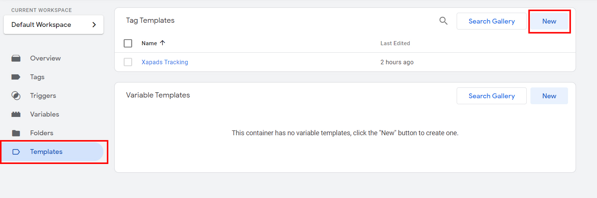
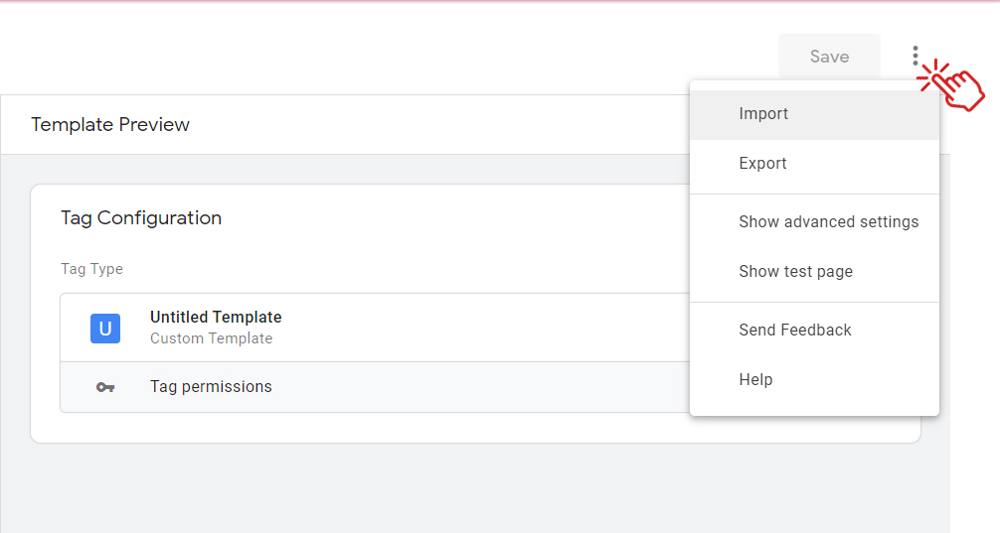
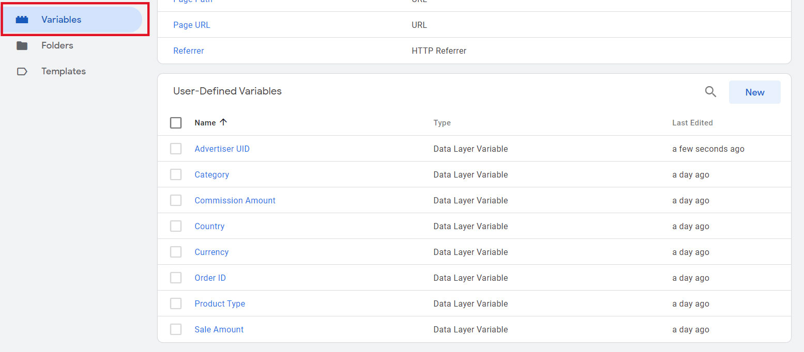
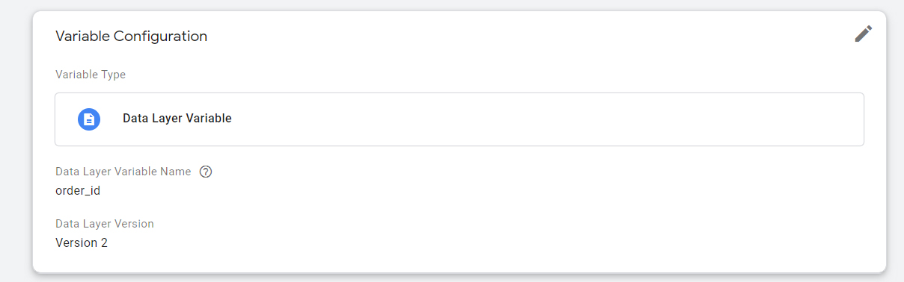
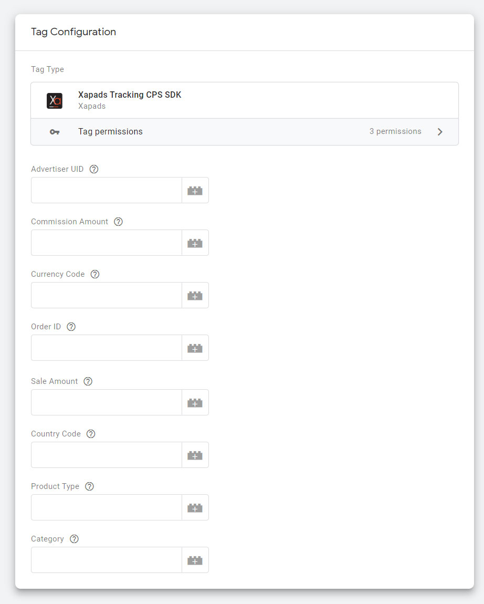

# Xapads CPS Tracking Template for Google Tag Manager

## Table of contents

* [Overview](#overview)
* [Contents](#contents)
* [Installation](#installation)
* [Configuration](#configuration)

## <a id="overview"></a>Overview

Welcome Advertiser,

Thanks for connecting to Xapads. This Google Tag Manager template provides an easy way to integrate [Xapads](https://www.xapads.com/) Attribution Pixel on your website. It will track users’ action on your website and send conversion tracking information to the Xapads tracking servers.

When the template fires, the Xapads server receives a request with the information on this action (Advertiser UID, order ID, commission amount, sale amount, currency, country, product type, category).


## <a id="contents"></a>Contents

Xapads Google Tag Manager Template Essentials:

It is required to [install](#installation) & configure the template properly as per the manual.

## <a id="installation"></a>Installation

1. Download the `template.tpl` file
2. Create a new tag template in the Templates menu

    

3. Import the `template.tpl` file

    
    

## <a id="configuration"></a>Configuration

Xapads Tracking template should fire on the **thank you page** of your site.
It is recommended to Configure tracking template as per your dataLayer variables.
Example Configuration is as below.

### dataLayer code

Example of the dataLayer code (real code on your site may differ):

```javascript
window.dataLayer = window.dataLayer || [];
dataLayer.push({
  advertiser_uid: "abc123xyz987",
  commission_amount: "0.01",
  currency_code: "USD",
  order_id: "ORD123",
  sale_amount: "1.0",
  country_code: "US",
  product_type: "TESTPRODUCT",
  category: "TESTCATEGORY"
});
```

### Google Tag Manager variables

You can configure the dataLayer variables in the Variables menu.





Mapping of dataLayer keys and GTM variables:

```md
'advertiser_uid' -> {{advertiser_uid}}
'commission_amount' -> {{commission_amount}}
'order_id' -> {{order_id}}
```

* ** *Advertiser UID would be provided by the Xapads.* **

### Template configuration

See an example of the configured template below.



**Advertiser UID**: Mandatory Macro - This is a unique identifier which you can get from Xapads.

**Commission Amount**: Mandatory Macro - This is a commission to Xapads (USD preferred).

**Currency Code**: Mandatory Macro - This would be 3 characters currency code. e.g. USD, INR

**Order ID**: Mandatory Macro - This will be your system Order Identifier (Order ID).

**Sale Amount**: Mandatory Macro - This will be your sale amount Identifier (Sale Amount). Make sure Commission Amount & Sale Amount follow the same currency as passed in Currency Code.

**Country Code**: Mandatory Macro - This would be 2 characters ISO code. e.g. US, IN

**Product Type**: Optional - This will be required when commission varies with product type or type of user. For e.g., new/old type of user.

**Category**: Optional - This will be required when commission varies with category.

